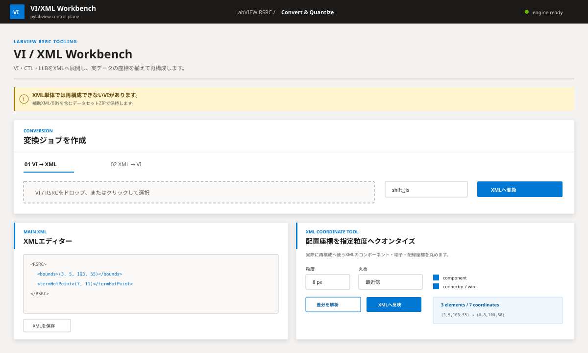

# VI/XML Workbench

LabVIEWのVI/RSRCファイルを`pylabview`でXMLデータセットへ展開し、構造確認・プロパティ編集・座標整列を行ったあと、VI/RSRCへ再構成するDocker Webアプリです。




## 主な機能

- VI、VIT、CTL、CTT、LLBなどのRSRCファイルをXMLデータセットへ展開
- メインXML、補助XML、未解析ブロックのBINをまとめてZIPで保持
- XMLデータセットからVI/RSRCを再構成
- 抽出直後のラウンドトリップ再構成とSHA-256比較
- 全XMLファイルを対象としたコンポーネント構造解析
- コンポーネント単位のclass、UID、名称、位置、サイズ、子要素、参照関係、全プロパティ表示
- 安全なプロパティのフォーム編集とXMLデータセットへの書き戻し
- コンポーネント、コネクタ、XML展開済み配線座標のグリッド量子化
- 実行コマンド、標準出力、標準エラー、処理時間の表示

画面はAzure Portalに近い配色、タイポグラフィ、パネル構成で統一しています。

## 起動

```bash
git clone https://github.com/youkan-man/app-viedit-py.git
cd app-viedit-py
docker compose up --build -d
```

ブラウザーで次を開きます。

```text
http://localhost:8080
```

ログ確認と停止:

```bash
docker compose logs -f --tail=200
docker compose down
```

ジョブデータはDocker volume `pylabview_data`へ保存されます。既定では最終更新から24時間後に清掃対象になります。

## 基本操作

### VIからXMLデータセットを作成

1. `VI → XML`を選択します。
2. VI/RSRCファイルをアップロードします。
3. 文字コードを選択します。日本語版Windowsで保存したVIは、まず`shift_jis`を使用します。
4. `XMLデータセットへ変換`を実行します。
5. 構造・プロパティ、XML、座標量子化、変換ログを確認します。
6. 必要に応じて編集し、VIを再構成します。

### XMLデータセットからVIを再構成

1. `XML → VI`を選択します。
2. このアプリが出力したデータセットZIP、またはXMLをアップロードします。
3. 必要に応じてメインXMLの相対パス、出力名、文字コードを指定します。
4. `VI / RSRCを再構成`を実行します。

補助XMLやBINを参照するVIでは、メインXML単体では再構成できません。通常はデータセットZIPを使用してください。

## コンポーネント構造ビュー

変換後の`VI構造・コンポーネント`画面では、ジョブ内の全XMLファイルを解析します。

### 解析対象

- すべてのXML要素
- すべてのXML属性
- テキスト値
- `SL__object`と`SL__rootObject`
- RSRC直下のセクション
- class、UID、名称、ラベル
- 配列と配列要素
- `SL__reference`などの参照
- XMLファイル間の参照
- 矩形、点、色、数値、真偽値、文字列
- バイナリまたは長大値の概要

解析件数には、XMLファイル数、要素数、属性数、値数、コンポーネント数、プロパティ数、class数、参照数を表示します。

### コンポーネント一覧

コンポーネントはXMLファイル、kind、class、UID、名称、XMLパスで検索できます。一覧には次を表示します。

- 表示名またはタグ名
- kind
- class
- UID
- プロパティ数
- 子コンポーネント数
- 参照数
- X、Y、幅、高さ
- 取得元XMLファイルとXMLパス

### プロパティインスペクター

コンポーネントを選択すると、次の情報を表示します。

- 親子階層とパンくず
- class、UID、tag、role、kind
- 代表矩形のX、Y、幅、高さ
- 全属性と全値
- 値の型
- 編集可否
- 子コンポーネント
- outbound / inbound参照
- 元XMLの階層構造

長大な構造はブラウザー停止を避けるため表示ノード数を制限します。XML解析自体は省略せず、検索とコンポーネント選択で対象を絞り込みます。

### プロパティ編集

画面から編集できるのは、再構成構造を直接壊しにくいスカラー値です。

編集可能な例:

- 名称、ラベル、説明
- 数値、真偽値、文字列
- 色などの数値プロパティ
- 矩形
- 点
- 座標タプル

読み取り専用の例:

- class
- UID
- XML構造識別子
- 参照先ID
- ファイル参照
- バイナリ値
- 子要素を含む混合値

保存時は、解析時のXMLファイルSHA-256と要素位置を再確認します。解析後にXMLが変更されていた場合は保存を拒否し、再解析を要求します。保存後はデータセットZIPを再生成し、以前の再構成結果と検証結果を旧版として扱います。

## XMLエディター

メインXMLはテキストでも編集できます。保存時にXML構文とルート要素`RSRC`を検証します。

メインXMLに未保存の変更がある間は、構造モデルとXMLの不一致を防ぐため、コンポーネントプロパティ編集を無効にします。XMLを保存すると構造を再解析します。

既定では8 MiBを超えるXMLはブラウザー編集を無効にします。その場合はデータセットZIPをダウンロードして外部エディターで編集し、再アップロードしてください。

## 座標量子化

座標量子化は、再構成に使用するXMLデータセット全体を対象にします。

1. グリッド粒度を1〜256 pxで指定します。
2. 最近傍、小さい側、大きい側の丸め方式を選択します。
3. 対象を選択します。
   - コンポーネント矩形
   - コネクタ、端子
   - XMLへ展開された配線ルート
4. 差分を解析します。
5. 対象ファイル、XMLパス、変更前、変更後を確認します。
6. データセットへ反映します。

矩形は既定で左上位置だけを丸め、幅と高さを維持します。`幅と高さも丸める`を有効にした場合だけサイズも変更します。

`compressedWireTable`や外部BINへ保持された配線情報は変更しません。XMLとして座標構造を確認できる配線だけを対象にします。

## データセットZIP

データセットZIPには、再構成に必要なファイルを相対パスを維持して保存します。

```text
main.xml
auxiliary-heap.xml
raw-block.bin
pylabview-web-manifest.json
```

ファイル名と構成はVIによって異なります。

## API

OpenAPI UI:

```text
http://localhost:8080/api/docs
```

主要エンドポイント:

| Method | Path | 内容 |
|---|---|---|
| `GET` | `/api/health` | アプリと`readRSRC`の状態 |
| `POST` | `/api/convert/vi-to-xml` | VI/RSRCからXMLデータセットを作成 |
| `POST` | `/api/convert/xml-to-vi` | XML/ZIPからVI/RSRCを再構成 |
| `GET` | `/api/jobs/{job_id}` | ジョブ状態 |
| `GET` | `/api/jobs/{job_id}/model` | 全XMLの構造解析サマリー |
| `GET` | `/api/jobs/{job_id}/components` | コンポーネント検索と一覧 |
| `GET` | `/api/jobs/{job_id}/components/{component_id}` | コンポーネント詳細 |
| `PATCH` | `/api/jobs/{job_id}/components/{component_id}` | 安全なプロパティを更新 |
| `GET/PUT` | `/api/jobs/{job_id}/xml` | メインXMLの取得と更新 |
| `POST` | `/api/jobs/{job_id}/quantize/preview` | 全XMLの座標差分を解析 |
| `POST` | `/api/jobs/{job_id}/quantize/apply` | 座標差分をデータセットへ反映 |
| `POST` | `/api/jobs/{job_id}/rebuild` | 現在のデータセットから再構成 |
| `GET` | `/api/jobs/{job_id}/download/{artifact}` | 成果物を取得 |
| `DELETE` | `/api/jobs/{job_id}` | ジョブを削除 |

## 設定

`docker-compose.yml`または環境変数で変更できます。

| 変数 | 既定値 | 内容 |
|---|---:|---|
| `WORK_ROOT` | `/data/jobs` | ジョブ保存先 |
| `MAX_UPLOAD_BYTES` | `268435456` | アップロード上限 |
| `MAX_ARCHIVE_BYTES` | `536870912` | ZIP展開後およびXML解析の合計上限 |
| `MAX_ARCHIVE_FILES` | `10000` | ZIP内の最大ファイル数 |
| `COMMAND_TIMEOUT_SECONDS` | `300` | `readRSRC`のタイムアウト |
| `INLINE_XML_MAX_BYTES` | `8388608` | ブラウザー編集可能なXML上限 |
| `JOB_TTL_HOURS` | `24` | ジョブ保持時間 |
| `LOG_MAX_CHARS` | `100000` | ログ保持文字数 |
| `PYLABVIEW_COMMAND` | `readRSRC` | 実行するpylabviewコマンド |

ポートを変更する例:

```yaml
ports:
  - "9000:8080"
```

## 対応範囲と制約

- 解析・再構成できるRSRCブロックは`pylabview`の対応範囲に依存します。
- 未解析ブロックはBINとして保持される場合があります。
- 構造ビューはXMLとして出力された全要素・属性・値をモデル化しますが、BIN内部を推測して展開しません。
- XMLの変更内容によっては、再構成に成功してもLabVIEWで開けない場合があります。
- XMLを変更していなくても、セクション順序やパディングの差で元ファイルとバイナリ一致しない場合があります。
- コンパイル時に削除されたブロックダイアグラムを復元する機能ではありません。
- LabVIEW本体はDockerイメージに含まれません。
- 生成したVI/RSRCは、対象バージョンのLabVIEWで確認してください。
- 認証機能はありません。ローカルまたは信頼できるネットワークで使用してください。

## pylabview

Dockerイメージでは次のコミットを固定して使用します。

```text
mefistotelis/pylabview
69768647c18d2d792a259b69884b2433761c3a4f
```

## ライセンス

このアプリはMIT Licenseです。依存ライブラリは各ライセンスに従います。詳細は`THIRD_PARTY_NOTICES.md`を参照してください。
